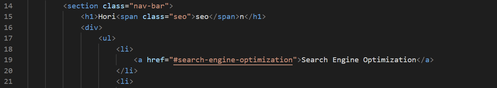
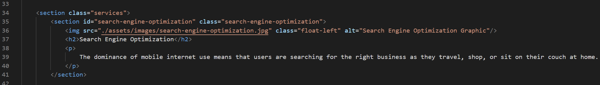

# UTA Boot Camp Challenge 1

## Description

The goal of this project was to add acessability to a website sent in with a support tiket. This was accomplished by formatting the HTML file to add semantic HTML elements, adding alt text to all images linked in the HTML, and corrected heading element sizing. Throughout the course of this project, I learned that semantic HTML elements, in addition to adding accesibility to websites, often makes code look cleaner when programming. Additionally, several technical errors were found while checking over code, inluding a pointer error in the nav bar, which resulted in an unresponsive button.

## Screenshots

This is the snippit of code from the nav-bar that points to the id "#search-engine-optimization", which was not present in the starter code.

This is a screenshot of the snippet that was corrected, notice that "#search-engine-optimization" is now present, making the button responsive.

## License

Please refer to the liscence present in the associated repo.
